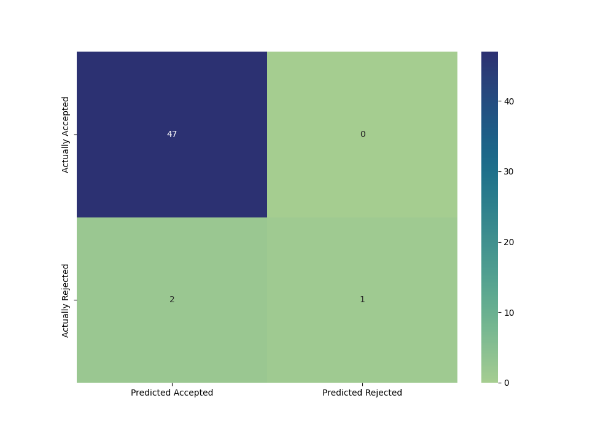

# <div style="text-align: center;">CIS6030 Information System</div>

## <div style="text-align: center;">Assignment 3</div>

## <div style="text-align: center;"> Enshen Zhu (1194726)</div>

****

### Before Start

1. Please install the PostgresSQL from the website
2. Create an **env.ini** file as follows, and place it with all the question folders (Please do not put this file inside
   any of the folders)
   ```
   [postgresql]
   host = localhost
   dbname = Student_Admission
   user = postgres
   password = cis6030
   ```
3. Open the pgAdmin4 and create a database named as "Student_Admission"

****

### Question 1

1. All related code are inside the Question 1 folder.
2. Before start, please place the dataset file into the folder and **rename it as the "Admission_Predict_trimmed"**.
   Please make sure the
   dataset is **explicitly trimmed**, by which the last three lines, which contains the max and min value information,
   should be
   removed from the dataset.

3. This script is going to save the raw "Admission_Prediction.csv" file into the PostgresSQL server. You may run it by
   enter ```python q1_main.py``` inside the terminal.
4. On the first three lines of the output, you may find out the general version information about the PostgresSQL server
   used:
   ```
   Connecting to the PostgreSQL database...
   PostgreSQL database version:
   ('PostgreSQL 15.0, compiled by Visual C++ build 1914, 64-bit',)
   ```
5. (Add the SQL command) The following lines shows the fetch results for all the data inside the created **student**
   table
   ```
   (1, 337, 118, 4, 4.5, 4.5, 9.65, 1, 0.92)
   (2, 324, 107, 4, 4.0, 4.5, 8.87, 1, 0.76)
   (3, 316, 104, 3, 3.0, 3.5, 8.0, 1, 0.72)
   (4, 322, 110, 3, 3.5, 2.5, 8.67, 1, 0.8)
   (5, 314, 103, 2, 2.0, 3.0, 8.21, 0, 0.65)
   ......
   ......
   ```
   By which each row shows the **Serial No. | GRE Score | TOEFL Score | University Rating | SOP | LOR | CGPA | Research
   |
   Chance of Admit** in sequence
6. (Optional) You may change to your own SQL command by changing the sql_command3 variable inside the view_table_content
   function of the q1_main.py
7. The final line of output ```Database disconnected.``` indicates that the database has been disconnected
   successfully.

****

### Question 2

1. All related code are inside the Question 2 folder.
2. This script is going to do the LinearRegression in regard to the date from the "Admission_Prediction.csv" file.
   However, the script withdraw the data from the PostgresSQL rather than the original csv file.
3. You may run this script by entering the ```python q2_main.py``` inside the terminal.
4. This script splits the original dataset into the training and testing data. **It randomly takes 90% of the original
   dataset into the training data, and the rest 10% into the testing data**.
5. When starting the script, the output will briefly report the training status as follows:
   ```
   Connecting to the PostgreSQL database...
   PostgreSQL database version:
   ('PostgreSQL 15.0, compiled by Visual C++ build 1914, 64-bit',)
   Multivariable Linear Regression training finished.
   ```
   Besides, it will report the numerical model of the linear regression:
   ```
   The linear regression model is y = 0.002127*X1 + 0.002555*X2 
   + 0.007459*X3 + -0.000584*X4 + 0.018436*X5 + 0.114668*X6 + 0.027368*X7 + -1.310231
   ```
   It will also report the coefficient of determination:
   ```
   The coefficient of determination is around 0.8285
   ```
   Since 0.8285 is a relatively high value in terms of 1; we assume that the trained multivariable linear regression
   model may have a high performance on predicting the output.
6. The program will also prompt the user to either **do the performance validation** of the trained model, or enter
   their own data to predict the admission rate.
   ```
   Press 1 to see a data validation from the test_dataset; 
   
   Press 2 to check the overall performance of the linear regression model 
   on all test dataset; 
   
   Press 3 to enter your only admission profile and check the admission rate; 
   
   Press 0 to exit
   ```
7. When pressing 1, the script will do the performance validation of the trained model, which randomly pick a row of
   data from the testing dataset, and compares **the real admission rate and the predicted admission
   rate**. For example:
   ```
   The student profile is as follow:
   GRE Score: 314 | TOEFL Score: 106 | University: 3 | SOP: 3.0
   LOR: 5.0 | CGPA: 8.90 | Research: 0
   The predicted admission rate is 0.76
   The real admission rate is 0.74
   ```
8. When pressing 2, the script will check the overall performance of the linear regression model
   on all test dataset. Specifically, it will report the **Coefficient of determination** and the **Mean Square Error**
   between the predicted_y and the real_y inside the testing dataset.
   ```
   By evaluating the linear regression model on all test dataset
   The R^2 score between the real y_test and the predict y_test is 0.8117
   The Mean Square Error between the real y_test and the predict y_test is 0.0033
   ```

   Accordingly, the R^2 score is around 0.8117, which means the predicted_y and the real_y are highly positively linear
   correlated. Besides, the Mean_Square_Error is around 0.0033, which indicates that the predict_y and the real_y have
   very small error differences. **Overall, the linear regression model has a highly precise performance on the testing
   dataset.**

9. When pressing 3, the script will take the user input and predict the admission rate. For example, if we enter the
   following information
   ```
   Enter GRE score: (the value should be an integer between 0 to 340>? 320
   Enter TOEFL score: (the value should be an integer between 0 to 120>? 110
   Enter University Rating: (the value should be a float number between 0 to 5)>? 4
   Enter the statement of purpose (the value should be a float number between 0 to 5)>? 4
   Enter the letter of recommendation strength (the value should be a float number between 0 to 5)>? 3
   Enter the undergraduate gpa (the value should be a float number between 0 to 10)>? 8.7
   Enter the research experience (the value should be binary, either 0 or 1)>? 1
   ```
   The output predicted admission rate with Linear Regression is:
   ```
   The predicted admission rate is 0.76
   ```
10. Press 0 to exit the script.
    ```
    Bye bye!
    Database disconnected.
    ```

****

### Question 3

**!!! Since the logistic regression requires outputs to be discrete values, we will normalize all the decimal
numbers(which are all between 0 and 1) into 0 or 1 by rounding them. Specifically, any value below 0.5 will be rounded
into 0, which means admission REJECTED. Meanwhile, any value equals or over 0.5 will be rounded into 1, which
means admission ACCEPTED. !!!**

1. All related code are inside the Question 3 folder.
2. The following contents will be quite similar to the question 2. However, critical difference should be aware.
3. This script is going to do the LogisticRegression in regard to the date from the "Admission_Prediction.csv" file.
4. You may run this script by entering the ```python q3_main.py``` inside the terminal.
   However, the script withdraw the data from the PostgresSQL rather than the original csv file.
5. This script splits the original dataset into the training and testing data. **It randomly takes 90% of the original
   dataset into the training data, and the rest 10% into the testing data**.
6. When starting the script, the output will briefly report the training status as follows:
   ```
   Connecting to the PostgreSQL database...
   PostgreSQL database version:
   ('PostgreSQL 15.0, compiled by Visual C++ build 1914, 64-bit',)
   Logistic Regression training finished.
   ```
7. Besides, it will report the property of the logistic regression
   ```
   The coefficient of determination is around 0.9444
   The interception is around -45.4342
   Column 0 has the coefficient around 0.0547
   Column 1 has the coefficient around 0.1095
   Column 2 has the coefficient around -0.1058
   Column 3 has the coefficient around -0.2197
   Column 4 has the coefficient around 0.8525
   Column 5 has the coefficient around 2.2423
   Column 6 has the coefficient around -0.1170
   ```

8. The program will also prompt the user to either **do the performance validation** of the trained model, or enter
   their own data to predict the admission rate.
   ```
   Press 1 to see a data validation from the test_dataset; 
   
   Press 2 to check the overall performance (with a confusion matrix) 
   of the logistic regression model on the test dataset. 
   
   Press 3 to enter your only admission profile and check the admission rate; 
   
   Press 0 to exit
   ```
9. When pressing 1, the script will do the performance validation of the trained model, which randomly pick a row of
   data from the testing dataset, and compares **the real admission case and the predicted admission
   case**. For example:
   ```
   The student profile is as follow:
   GRE Score: 329 | TOEFL Score: 110 | University: 2 | SOP: 4.0
   LOR: 3.0 | CGPA: 9.15 | Research: 1
   The predicted admission case with logistic regression is 1. The predicted admission status: Accepted
   The real admission case is 0.84, which is normalized into 1. The real admission status: Accepted
   ```

10. When pressing 2, the script will report the overall performance (with a confusion matrix) of the logistic regression
    model on the test dataset. It will summarize the accuracy rate between the predicted admission status and the real
    admission status.
    ```
    By evaluating the logistic regression model on all test dataset
    The accuracy of the model is 96.00 percents
    ```
11. Moreover, the script will generate the **Confusion Matrix** between the predicted and the real case among the test
    dataset. **(If the confusion matrix cannot properly display here, please find the original image at "
    ./Question3/confusion_matrix.png")**

    

    The confusion matrix indicates that for all 50 test cases
    * 47 cases are both "Predicted Accepted" and "Actually Accepted"
    * 2 cases are "Predicted Accepted" but "Actually Rejected"
    * 0 cases are "Predicted Rejected" but "Actually Accepted"
    * 1 case is both "Predicted Rejected" but "Actually Rejected"

    Therefore, the logistic regression does have a good performance on the test dataset.

12. When pressing 3, the script will take the user input and predict the admission case. For example, if we enter the
    following information
   ```
   Enter GRE score: (the value should be an integer between 0 to 340>? 300
   Enter TOEFL score: (the value should be an integer between 0 to 120>? 98
   Enter University Rating: (the value should be a float number between 0 to 5)>? 3
   Enter the statement of purpose (the value should be a float number between 0 to 5)>? 3
   Enter the letter of recommendation strength (the value should be a float number between 0 to 5)>? 1
   Enter the undergraduate gpa (the value should be a float number between 0 to 10)>? 5.5
   Enter the research experience (the value should be binary, either 0 or 1)>? 0
   ```

   The output predicted admission rate with Logistic Regression is:
   ```
   The predicted admission rate with logistic regression is 0. It predict the admission status is Rejected.
   ```
   
13. Press 0 to exit the script.
   ```
   Bye bye!
   Database disconnected.
   ```